# LS AAI with Keycloak behind Caddy

This document explains how to start keycloak in a docker container behind a caddy reverse proxy for authentication via LS AAI.

## Caddy

### Installation
```sh
sudo apt install -y debian-keyring debian-archive-keyring apt-transport-https curl
curl -1sLf 'https://dl.cloudsmith.io/public/caddy/stable/gpg.key' | sudo gpg --dearmor -o /usr/share/keyrings/caddy-stable-archive-keyring.gpg
curl -1sLf 'https://dl.cloudsmith.io/public/caddy/stable/debian.deb.txt' | sudo tee /etc/apt/sources.list.d/caddy-stable.list
sudo apt update
sudo apt install caddy
```

### Configuration
Create a caddyfile:

```json
# keycloak
s3dev.bi.denbi.de:8080 {
    bind 192.168.20.192
    reverse_proxy localhost:8080
}
```

and start caddy with it:

```sh
caddy stop
caddy start --config /path/to/Caddyfile
```

## General Keycloak LS AAI Structure

The following figure separates the authentication process into multiple steps. This document will often refer to the steps mentioned here.

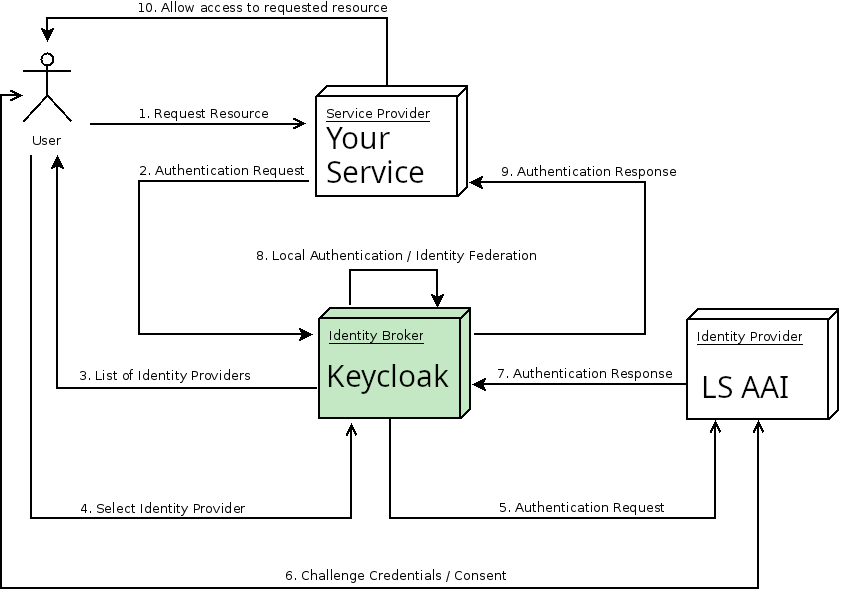

The main idea is that the User - let's say you - 1. requests a resource from your service/program which triggers your service to 2. request authentication from your Identity Broker Keycloak. You get the option to 3. identify via for example LS AAI (the Identity Provider) and 4. you select LS AAI. 5. Keycloak asks LS AAI to handle authentication. 6. LS AAI will now ask you to login and it then 7. tells Keycloak that everything went well (or not). Keycloak 8. might apply additional rules 9. then tells your service how authentication went and 10. your service allows access if everything went well.

The benefit of using the open source software Keycloak as an Identity Broker is that you have more control when handling authentication requests. You can add groups and so on without needing LS AAI to have those.

## Starting Keycloak In a Docker Container

In our case we want to start Keycloak within docker on our machine at https://s3dev.bi.denbi.de on Port 8080 with a premade admin user (we picked a more secure username+password combination) that works through Caddy (our reverse proxy).

```sh
docker run --net host -e KC_HTTP_HOST=127.0.0.1 -e KC_HTTP_PORT=8080 -e KC_HOSTNAME=https://s3dev.bi.denbi.de:8080 -e KC_BOOTSTRAP_ADMIN_USERNAME=adminusername -e KC_BOOTSTRAP_ADMIN_PASSWORD=adminpassword -e KC_PROXY_HEADERS=forwarded -e KC_PROXY_TRUSTED_ADDRESSES=192.168.20.192 -e KC_FEATURES="hostname:v2" -d quay.io/keycloak/keycloak:26.0.7 start-dev
```

### Important Documentation Links Keycloak Startup

- https://www.keycloak.org/server/features
- https://www.keycloak.org/server/all-config
- https://www.keycloak.org/server/hostname

## Setting Up Keycloak with Life Science AAI Service

### AAI Service 

#### Prerequisites
Own a service at https://services.aai.lifescience-ri.eu/. Your services can be found at "My Services" when you are logged in. What follows are our settings plus some helpful comments.

#### Configuring

With the **5. Authentication Request** Keycloak asks from LS AAI to send the **7. Authentication Respond** to its **redirect_url** for LS AAI. This redirect_url is generated by Keycloak in the Identity Provider tab. This redirect_url needs to be whitelisted in the LS AAI service's **SAML/OIDC** tab (as shown below). The covered **Client ID** and **Client Secret** keys are required by Keycloak later on and are generated by LS AAI.
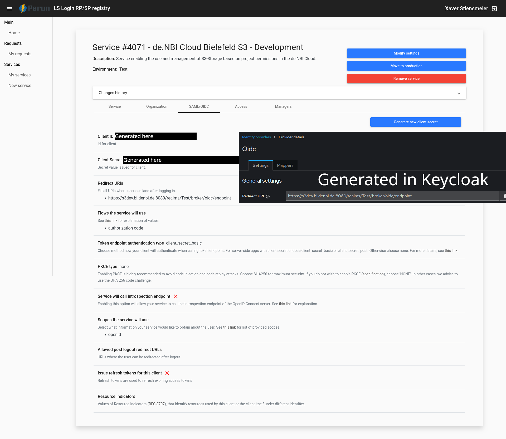 You will find that info [later in Keycloak](#create-an-openid-connect-identity-provider).

As you can see in our **Access** tab we only allow access to our test service for a user group. This user group is defined by TODO. This ensures that our test service cannot be accessed by others while we play around with it.
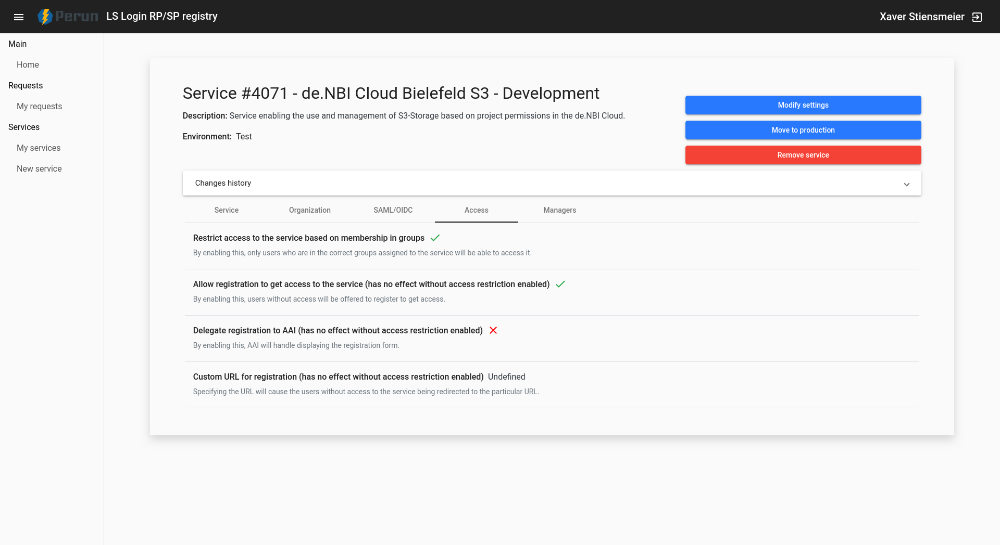
The other images are shown uncommented. For your use case you will add other info here, but it is not directly relevant for this minimal setup.
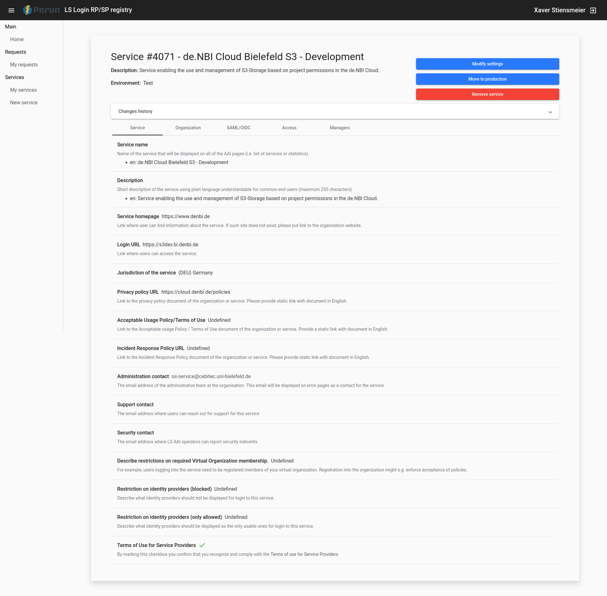
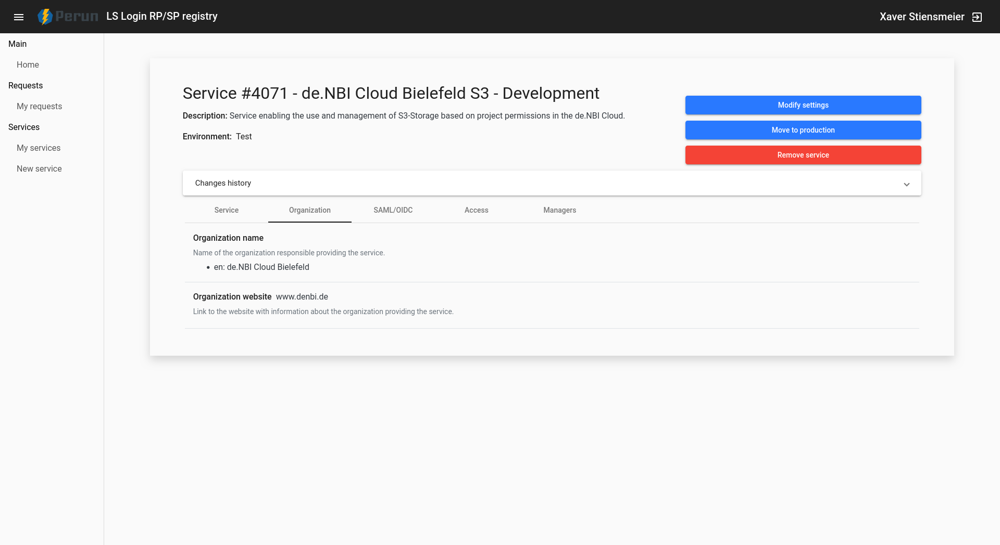


### Keycloak
#### Login
Log into the admin panel of Keycloak found at KC_HOSTNAME - for our example `https://s3dev.bi.denbi.de:8080`.

#### Create a Realm

> **Realms**   
> A realm manages a set of users, credentials, roles, and groups. A user belongs to and logs into a realm. Realms are isolated from one another and can only manage and authenticate the users that they control.


First you need to create a realm. Click on `master` and then `Create realm`.

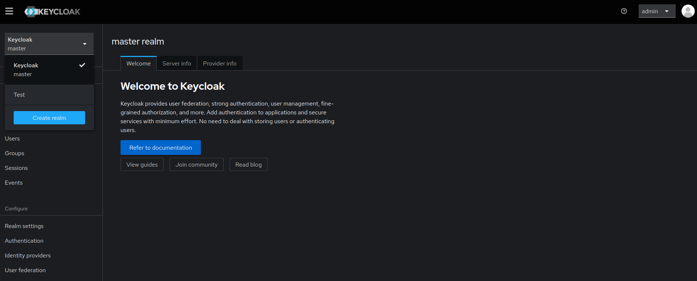

You will notice that in the following our realm is sometimes called foo and sometimes Test. foo has just been created to take some more screenshots. Ignore the name difference.

#### Create an OpenID Connect Identity Provider

> **Identity Provider**   
> An identity provider (IDP) is a service that can identify and validate users. LS AAI is an IDP. Keycloak is also an IDP, but that is less relevant here.


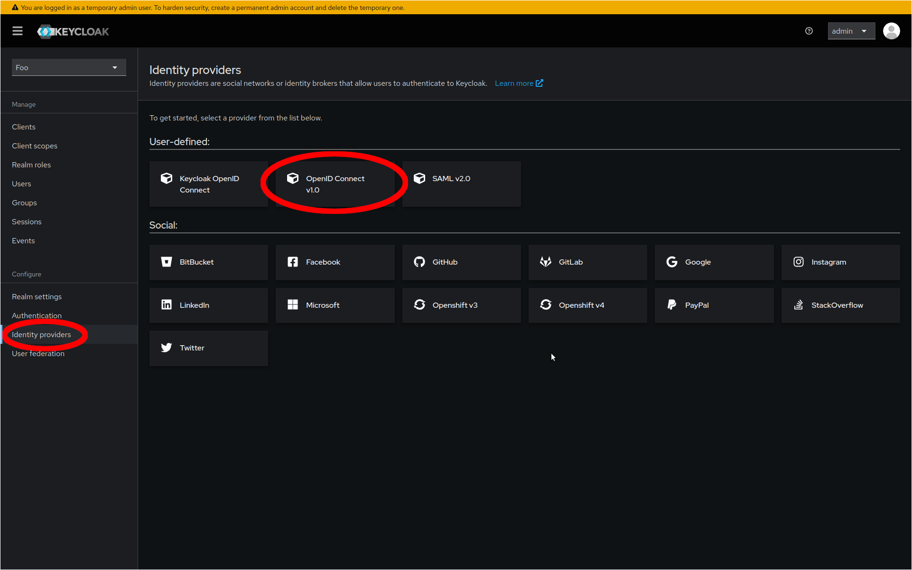

You now give the Identity Provider an Alias (unique name).

Then transfer the **Client ID** and **Client Sercret** from LS AAI's **SAML/OICD** tab to Keytone's **Add OpenID Connect provider** tab's Client ID and Client Secret fields.

At this point you also transfer the **Redirect URI** from Keycloak's **Add OpenID Connect provider** tab to LS AAI's **SAML/OICD** tab's Redirect URIs field.

We mentioned these steps already in [Configuring](#configuring).

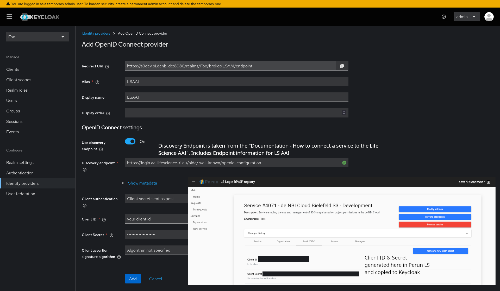

#### Create a Client in Keycloak

> **Clients**   
> Clients are entities that can request Keycloak to authenticate a user. For now, clients are applications and services that want to use Keycloak to secure themselves and provide a single sign-on solution.

Create a client:

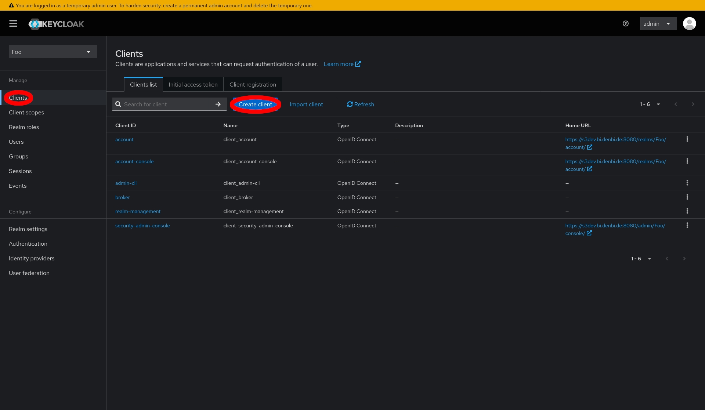

Now you need to add the **Client ID** from LS AAI's **SAML/OICD** tab again.

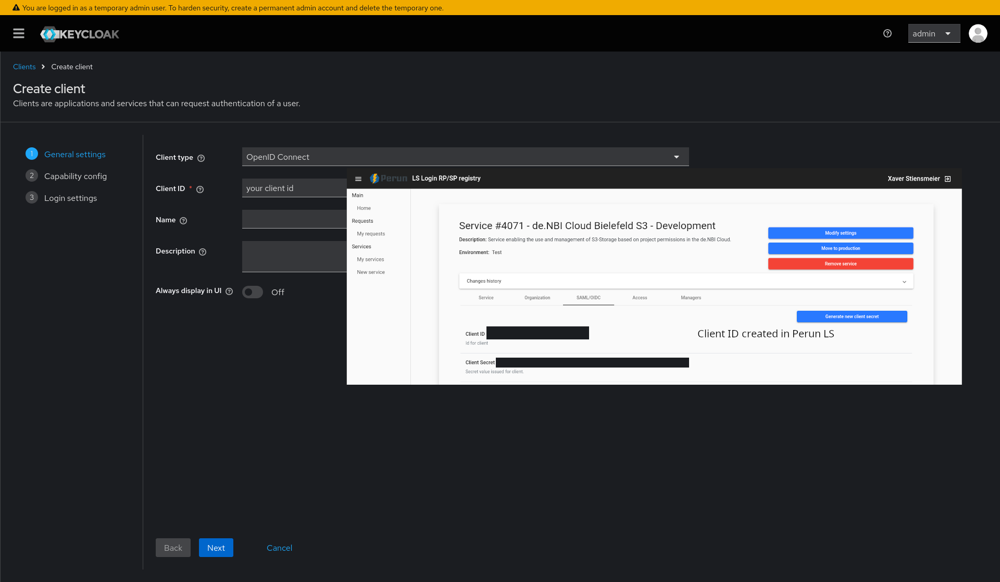

On the next page you can activate **Client authentication**.

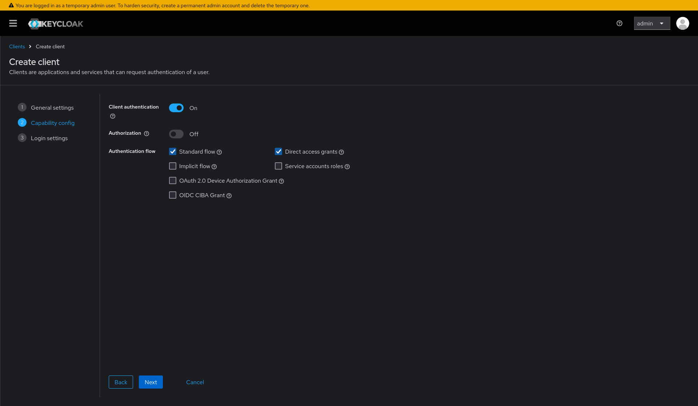

On the next page the most importent field is Valid redirect URIs which sets what URIs Keycloak accepts for **10. Allow Access To Restricted Resource**. We add `https://s3dev.bi.denbi.de/authorize` for testing purposes only

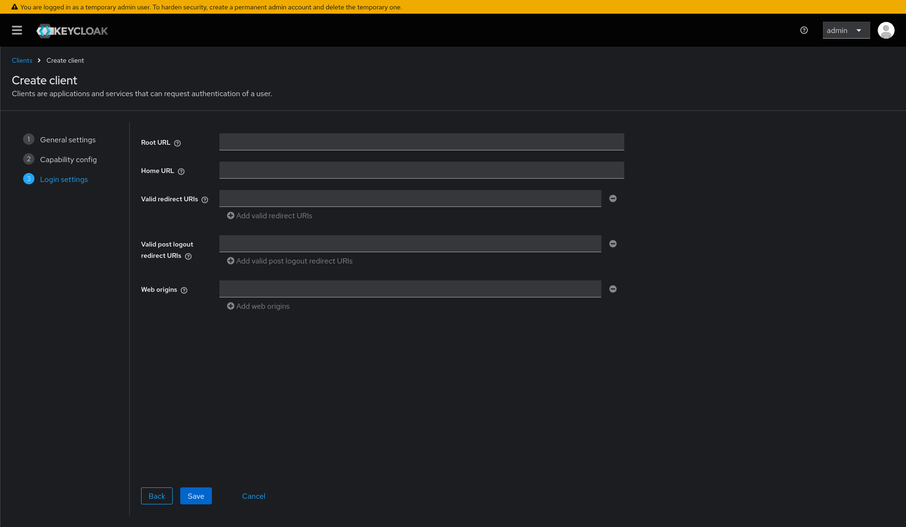

### Result Conclusion

#### Less Detailed

As you can see this works pretty similar to LS AAI which again highlights that Keycloak can also be used as an Identity Provider. Both Keycloak and LS AAI are asked for authentication and both receive a redirect URI that both had white listed beforehand. We ask Keycloak with redirect_url_1, Keycloak has the redirect_url_1 whitelisted and therefore asks an Identity Provider of our choice, here LS AAI, with redirect_url_2 (as generated by [Create an Identity Provider](#create-an-openid-connect-identity-provider)). LS AAI confirms the request and sends the result to redirect_url_2 watched by Keycloak. Keycloak might add additional information and redirects to redirect_url_1 of our service/program and our service checks the token and gives access to the resource.

#### More Detailed

Our service can now send an 2. authentication request https://s3dev.bi.denbi.de:8080/realms/Test/protocol/openid-connect/auth?client_id=CLIENTID&redirect_uri=https://s3dev.bi.denbi.de/authorize&response_type=code&scope=openid to Keycloak. As you contact Keycloak's realm **Test** and the redirect_uri is whitelisted in Keycloak (we added it), it will 3. ask you to select an identity provider. 

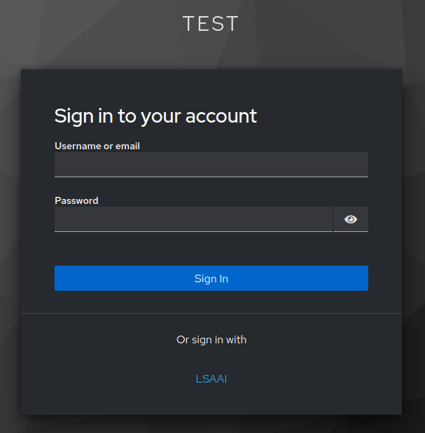

Since we have registered LS AAI (with display name `LSAAI`) as an Identity Provider it is listed. 4. Selecting it 5. requests authentication from LS AAI with https://login.aai.lifescience-ri.eu/oidc/authorize?scope=openid&state=STATE&response_type=code&client_id=CLIENTID&redirect_uri=https://s3dev.bi.denbi.de:8080/realms/Test/broker/oidc/endpoint&nonce=HgYhpHHZkaRoAkgxYI1bDQ which contains the redirect as generated by [Create an Identity Provider](#create-an-openid-connect-identity-provider) to Keycloak. 

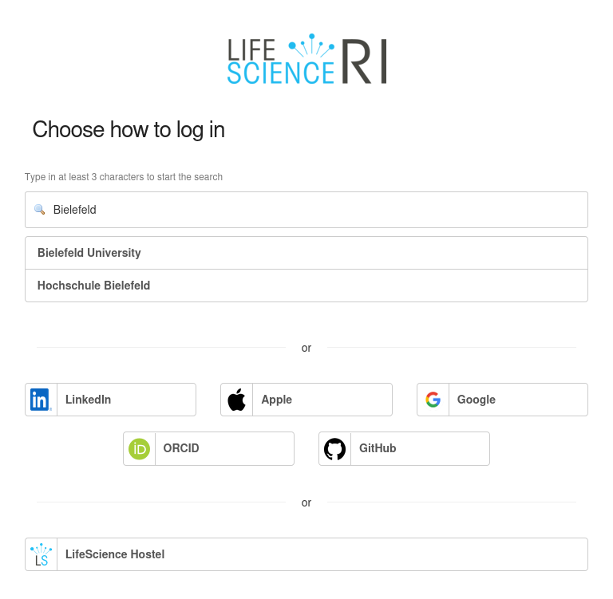

Now the user needs to 6. pass LS AAI which then 7. redirects the response to Keycloak https://s3dev.bi.denbi.de:8080/realms/Test/broker/oidc/endpoint?code=CODE1&state=STATE1 then 8. Keycloak might add additional information and 9. redirects to your service with https://s3dev.bi.denbi.de/authorize?session_state=STATE2&code=CODE2 and then 10. your service can give access to the resource.

#### Accessing Keycloak With Your Service

Keycloaks well known: `keycloakhost:keycloakport/realms/{realm}/.well-known/openid-configuration` so for our test https://s3dev.bi.denbi.de:8080/realms/Test/.well-known/openid-configuration

In order to connect to Keycloak use a package like oic and [implement a client](https://pyoidc.readthedocs.io/en/latest/examples/rp.html). Sadly, time didn't allow us to present a tested client implementation yet. This might be done in the future.

## Important Documentation

### Important Documentation Links Keycloak
- https://www.keycloak.org/docs/latest/server_admin/#_authentication-flows
### Important Documentation Links Life Science AAI
- [Google Docs| Documentation - How to connect a service to the Life Science AAI](https://docs.google.com/document/d/17pNXM_psYOP5rWF302ObAJACsfYnEWhjvxAHzcjvfIE/edit?tab=t.0)
- [Google Docs| Documentation - Attributes available for relying services](https://docs.google.com/document/d/1N8naf9Oaams0S1f6S8igXVm2HjY6fyvwRaggN_5MsrY/edit?tab=t.0)
- [Google Docs| Design Guidelines for Implementing Life Science AAI as a login provider](https://docs.google.com/document/d/1y_X68xmjgKWkVY94vDyp-lP8w8AxZRA2Wv2zxdYDFJA/edit?tab=t.0)