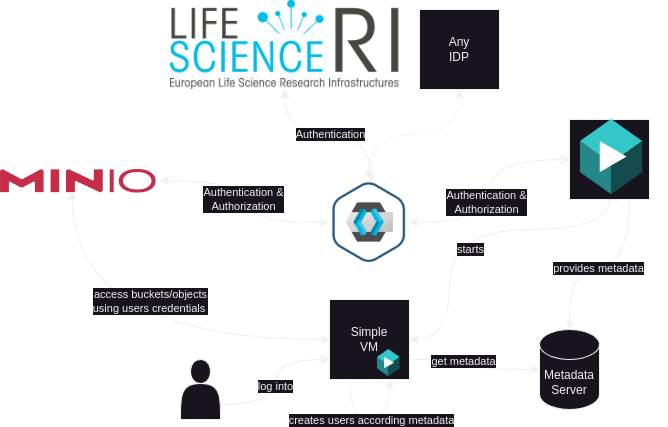

## Simple Vm in Trusted Research Environments

[SimpleVM](https://cloud.denbi.de/about/project-types/simplevm/) is a platform built on top on [OpenStack](https://openstack.org) to simplify the provision of virtual instances to users. Currently, SimpleVM uses images based on Ubuntu with the user 'ubuntu'. As part of this proof of concept, users will be created by the owner of the VM with the help of a metadata server. In a second step, the respective user's buckets will be mounted on the VM (via MinIO client or rclone)

